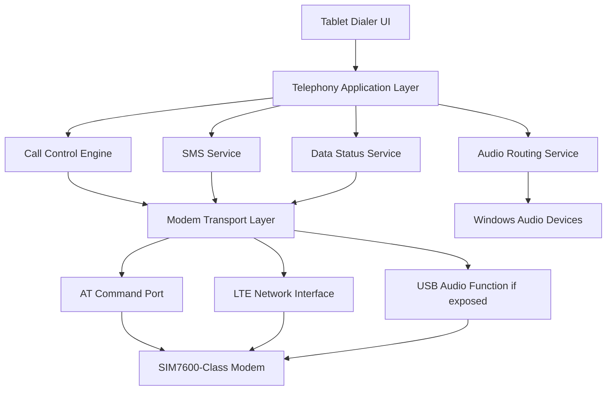

# Architecture

## System Model

The stack should be built as a layered Windows application rather than a monolith.

## Major Components

### 1. Modem Transport Layer

Responsibilities:

- Enumerate modem-attached COM ports
- Open and manage the AT command channel
- Serialize commands and parse responses
- Handle unsolicited result codes such as `RING`, `NO CARRIER`, `BUSY`, and registration changes
- Detect disconnect and reconnect conditions

This layer should know how to talk to the modem, but it should not own business logic such as whether to auto-answer or how the UI behaves.

### 2. Call Control Engine

Responsibilities:

- Maintain the call-state machine
- Place outgoing calls
- Accept or reject incoming calls
- Track ringing, active, held, ended, and failed states
- Normalize modem events into application events

Suggested states:

- `Disconnected`
- `Idle`
- `Dialing`
- `RingingIncoming`
- `Answering`
- `Active`
- `HangingUp`
- `Error`

### 3. Audio Routing Service

Responsibilities:

- Identify whether the modem exposes a usable USB audio device
- Bind input and output devices for active calls
- Switch routes when devices appear or disappear
- Expose mute, gain, and device-selection controls to the app

This is the highest-risk subsystem and should be isolated accordingly.

### 4. SMS Service

Responsibilities:

- Send SMS
- Receive and persist inbound SMS
- Normalize text encoding and message status

This is lower risk than voice and should be used early to validate modem control reliability.

### 5. Data Status Service

Responsibilities:

- Monitor modem registration and packet data status
- Report signal, operator, and attachment state
- Surface connection health to the UI

This service is mostly observability and should remain simple.

## Recommended Process Model

Prefer a local service plus UI split.

- Background service: owns modem sessions, event handling, reconnects, and call state
- Tablet UI: consumes a local API and renders dialer, SMS, and status screens

Reasons:

- The modem lifecycle should not depend on UI lifetime.
- Incoming call handling should still work when the UI is minimized or restarted.
- Audio and call state recovery are easier when ownership is centralized.

## Windows Integration Notes

- Treat Windows as a host OS, not as the telephony engine.
- Use standard Windows APIs for serial, device detection, and audio routing.
- Do not assume built-in mobile broadband features will solve call control.

## Hardware Platform Guidance (WWAN + mPCIe)

- Prefer 2-in-1 laptops with an accessible WWAN slot (mPCIe or M.2 WWAN) for internal modem flexibility.
- mPCIe is ideal for modular LTE modem cards; M.2 is common in newer thin designs and may be acceptable if not OEM-locked.
- Verify service manuals for slot type, SIM card access, and antenna cable connectors before purchase.
- Watch out for OEM whitelists that lock the slot to specific factory modules.
- If an internal WWAN slot is unavailable, fallback to USB-based external modems (SIM7600-class) is supported.

## Technical Risks

1. Audio path discovery may differ across modem boards and adapters.
2. VoLTE provisioning may fail even when data works.
3. USB reconnect behavior may cause COM port renumbering.
4. Some modem variants may support data but behave inconsistently for voice on T-Mobile.

## Architecture Decision

Start with one known-good modem family and one carrier. Generalization should come later.